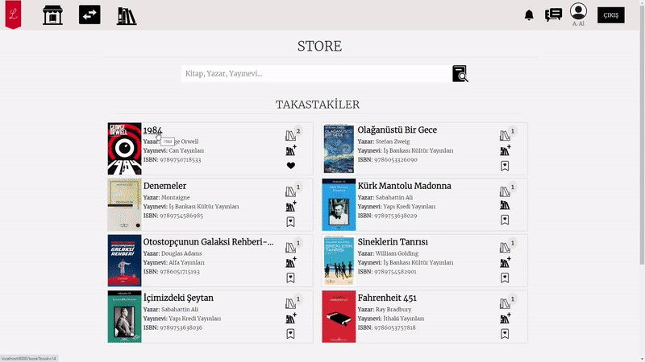

## About Project

This project is a simple web application for book lovers to exchange books with each other. Users can offer books from their own collections to other users for exchange, and similarly, other users can offer their books for swapping. Additionally, instant messaging is provided to facilitate communication between users.

## Features
- **User Profile:** Users can create a profile where they can add their book collections, specify the books they want to swap, and share their contact information. The profile enables users to receive and send swap offers.
- **Book Search and Addition:** Users can search for books they wish to swap and add them to their collections. Search results can be filtered based on criteria such as book title, author, or ISBN.
- **Trade Proposals and Acceptance/Rejection:** Users can send trade proposals for books they want to swap with other users. After receiving a proposal, the recipient user can review and either accept or reject it.
- **Instant Messaging:** Users can communicate with each other through the application's instant messaging feature.
- **Notifications:** Users receive important notifications related to trade proposals, acceptance or rejection statuses, ensuring they stay informed and enabling effective communication.

## Technologies
- **Front-end:** Bootstrap
- **Back-end:** Laravel
- **Database:** MySQL
- **Messaging:** Pusher

## Preview

